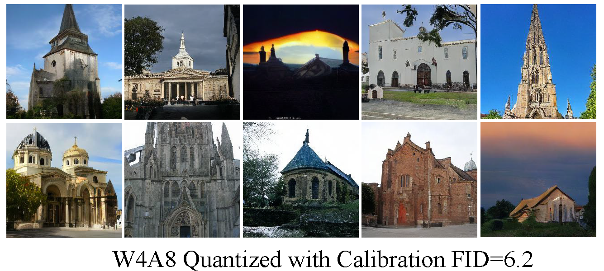
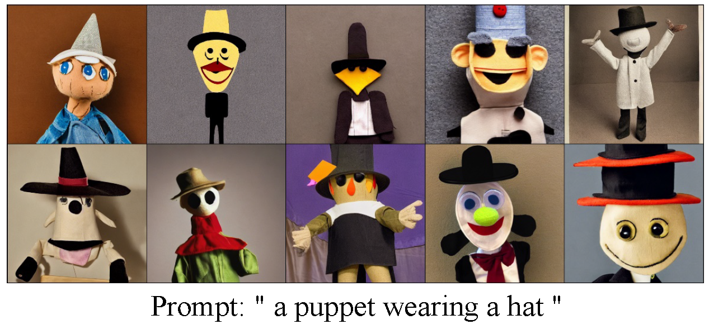
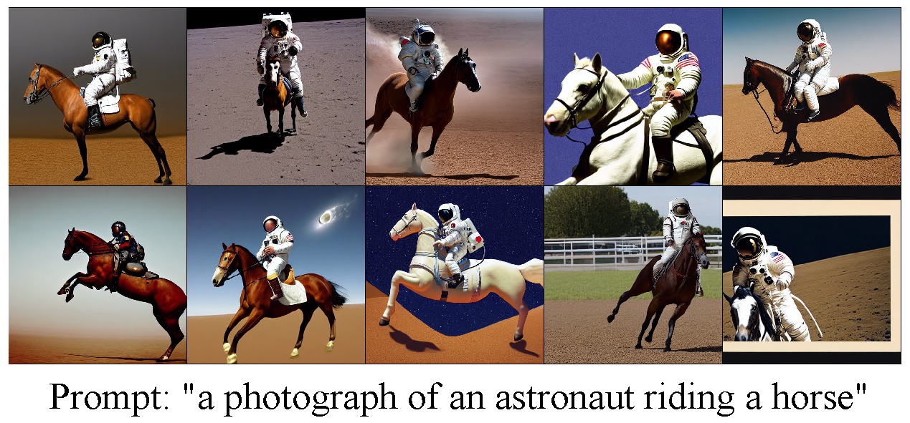

# 说明

这项研究是用作Stable Diffusion的压缩和加速，在该研究中，我们主要针对ldm, Stable Diffusion 两种模型进行量化实验，实验数据主要采用LSUN_Bedroom, LSUN_Churches 在无条件场景下 和 txt2image在有条件场景下进行的实验，针对模型我们采用训练后量化(Post-training quantization)方法对模型的进行实现，以下是实验的配置。

#### 第一步：实验环境配置

1. 根据 ``environment.yml``创建名为 ``quantdiff``的环境，并安装包依赖，然后激活环境。

   ```
   conda env create -f environment.yaml
   conda activate quantdiff
   ```
2. 对于隐向量 Latent Diffusion 和 Stable Diffusion 实验, 首先，从CompVis中在 [latent-diffusion](https://github.com/CompVis/latent-diffusion#model-zoo) 和 [stable-diffusion](https://github.com/CompVis/stable-diffusion#weights) 下载相关的预训练模型 ``checkpoints``. 目前，我们的Stable Diffusion使用 `sd-v1-4.ckpt`.
   下载LSUN在不同数据集上的 预训练模型 ``model.ckpt`` 到对应的文件目录 ``bedroom``和 ``churches``中。

   ```
   cd models/ldm/lsun_beds256
   wget  https://ommer-lab.com/files/latent-diffusion/lsun_bedrooms.zip
   unzip lsun_bedrooms.zip
   ```

   ```
   cd models/ldm/lsun_churches256
   wget  https://ommer-lab.com/files/latent-diffusion/lsun_churches.zip
   unzip lsun_churches.zip
   ```

   ```
   cd  models/ldm/text2img256
   wget  https://ommer-lab.com/files/latent-diffusion/text2img.zip 
   unzip text2img.zip
   ```
3. 为stable diffusion添加预训练模型参数:

   ```
   ln -s <path/to/model.ckpt> models/ldm/stable-diffusion-v1/model.ckpt 
   ```

#### 第二步：校准集构建
 ```--calib_data [raw_data|noise_data|timestep_aware] ```

```raw_data```: 原始数据集中的数据采样进行校准；

```noise_data```：直接采样噪声数据作为样本对模型进行校准；

```timestep_aware```：通过动态采样的方法实现时间步T中的每一个时间步间隔t的采样，由此生成的样本是噪声到原始样本的分布的结合，这步可以自己采样实现，也可用开源提供的Google Drive[校准集](https://drive.google.com/drive/folders/1ImRbmAvzCsU6AOaXbIeI7-4Gu2_Scc-X?usp=share_link)。

#### 第三步：量化训练

1.1. 在bedroom数据集上进行量化训练，执行以下操作：

```bash
    # W8A8
    python scripts/ldm_quante_bedroom.py -r models/ldm/lsun_beds256/model.ckpt -n 5000 --batch_size 64 -c 100 -e 1.0 --seed 41  --weight_bit 4 --act_bit 8 -l output/lsun --wwq --waq --act_quant --data_dir /data/rrshao/datasets/bedroom_train/ --calib_data noise_data --use_adaround --ptq  --calib_model 
  
    # W4A8
    python scripts/ldm_quante_bedroom.py -r models/ldm/lsun_beds256/model.ckpt -n 5000 --batch_size 64 -c 100 -e 1.0 --seed 41  --weight_bit 8 --act_bit 8 -l output/lsun --wwq --waq --act_quant --data_dir /data/rrshao/datasets/bedroom_train/ --calib_data noise_data --use_adaround --ptq  --calib_model 
```

1.2. 在bedroom数据集上,采样量化后的训练数据:

```bash
    # W8A8
    python scripts/ldm_quante_bedroom.py -r models/ldm/lsun_beds256/model.ckpt -n 5000 --batch_size 64 -c 100 -e 1.0 --seed 41  --weight_bit 8 --act_bit 8 -l output/lsun --wwq --waq --act_quant --data_dir /data/rrshao/datasets/bedroom_train/ --calib_data noise_data --use_adaround --ptq  
  
    # W4A8
    python scripts/ldm_quante_bedroom.py -r models/ldm/lsun_beds256/model.ckpt -n 5000 --batch_size 64 -c 100 -e 1.0 --seed 41  --weight_bit 4 --act_bit 8 -l output/lsun --wwq --waq --act_quant --data_dir /data/rrshao/datasets/bedroom_train/ --calib_data noise_data --use_adaround --ptq   
```

2.1. 在churches数据集上进行量化训练，执行以下操作：

```bash
    # W4A8
    python scripts/ldm_quante_churches.py -r models/ldm/lsun_churches256/model.ckpt -n 1000 --batch_size 64 -c 200 -e 1.0 --seed 41 --weight_bit 4 --act_bit 8 -l output/lsun  --wwq --waq --act_quant --data_dir /data/rrshao/datasets/lsun/church_outdoor_train/ --calib_data raw_data  --ptq  --calib_model --use_adaround

    # W8A8
    python scripts/ldm_quante_churches.py -r models/ldm/lsun_churches256/model.ckpt -n 1000 --batch_size 64 -c 200 -e 1.0 --seed 41 --weight_bit 8 --act_bit 8 -l output/lsun  --wwq --waq --act_quant --data_dir /data/rrshao/datasets/lsun/church_outdoor_train/ --calib_data raw_data  --ptq  --calib_model --use_adaround
```

2.2. 在churches数据集上,采样量化后的训练数据:

```bash
    # W4A8
    python scripts/ldm_quante_churches.py -r models/ldm/lsun_churches256/model.ckpt -n 1000 --batch_size 64 -c 200 -e 1.0 --seed 41 --weight_bit 4 --act_bit 8 -l output/lsun  --wwq --waq --act_quant --data_dir /data/rrshao/datasets/lsun/church_outdoor_train/ --calib_data raw_data  --ptq  --use_adaround

    # W8A8
    python scripts/ldm_quante_churches.py -r models/ldm/lsun_churches256/model.ckpt -n 1000 --batch_size 64 -c 200 -e 1.0 --seed 41 --weight_bit 8 --act_bit 8 -l output/lsun  --wwq --waq --act_quant --data_dir /data/rrshao/datasets/lsun/church_outdoor_train/ --calib_data raw_data  --ptq  --use_adaround
```

2.2. 在txt2image任务上,采样量化后的训练数据:

```bash
    # W4A8
    python scripts/txt2img_quante.py --prompt  "a cat wearing a hat" --plms --cond --ptq --weight_bit 4 --act_bit 8 --quant_mode qdiff --no_grad_ckpt --split --n_samples 5 --outdir output_path/txt2img --wwq --waq --calib_data timestep_aware  --cali_data_path clib_data/sd_coco-s75_sample1024_allst.pt  --cali_st 2 --cali_n 8 --use_adaround 

    # W8A8   
    python scripts/txt2img_quante.py --prompt  "a cat wearing a hat" --plms --cond --ptq --weight_bit 8 --act_bit 8 --quant_mode qdiff --no_grad_ckpt --split --n_samples 5 --outdir output_path/txt2img --wwq --waq --calib_data timestep_aware  --cali_data_path clib_data/sd_coco-s75_sample1024_allst.pt  --cali_st 2 --cali_n 8 --use_adaround 
```


#### 第四步：实验结果评估

数据集Bedroom256

| Calib | Bits(W/A) | IS | FID |
| :---: | :------: | :-: | :-: |
| Baseline| W32A32 | 11.3| 3.2 | 
|  W/O  |   W4A8   | 7.3 | 21.2|
|   W   |   W4A8   | 8.7 | 5.8 |
|  W/O  |   W8A8   | 4.6 | 17.1 |
|   W   |   W8A8   | 6.2 | 4.9 |


数据集Churches256                               

| Calib | Bits(W/A) | IS | FID |
| :---: | :------: | :-: | :-: |
| Baseline| W32A32 | 10.1| 4.2 | 
|  W/O  |   W4A8   | 4.6 | 29.5 |
|   W   |   W4A8   | 8.1 | 6.2 |
|  W/O  |   W8A8   | 6.3 | 15.9 |
|   W   |   W8A8   | 10.8 | 4.8 |


#### 第五步：实验结果可视化
Bedroom dataset in W4A8 quanted with calibration.


Churches dataset in W4A8 quanted with calibration.


Prompt: "a cat wearing a hat" W8A8 quanted with calibration.


Prompt  "a cat wearing a hat" W8A8 quanted with calibration.


Prompt "a cat wearing a hat" W4A4 quanted with calibration. 


Prompt "a cat wearing a hat" W8A8 quanted with calibration.


#### 第六步：实验结论
1. 在模型量化中的，激活部分的重要性是高于权重的量化，因此，最好保证激活的部分的量化不低于8bit.
2. 在diffusion实验中，在过分不追求量化效果的场景下，直接噪声的校准也能有效提高模型精度，这样能够加快校准的速度。此外，时间步采样构建的校准集在复现的效果上提升不少。
3. 目前的实验，在8bit下相对成熟，建议使用W8A8或者W4A8，作为进行量化。

#### 第七步：部署推理
部署推理由于需要现有的推理框架支持以适应目前的硬件，目前市场上应用最广泛的部署工具主要有以下几种：腾讯公司开发的移动端平台部署工具——NCNN；Intel公司针对自家设备开开发的部署工具——OpenVino；NVIDIA公司针对自家GPU开发的部署工具——TensorRT；Google针对自家硬件设备和深度学习框架开发的部署工具——MediaPipe；由微软、亚马逊 、Facebook 和 IBM 等公司共同开发的开放神经网络交换格式——[ONNX](https://onnx.ai/)(Open Neural Network Exchange)。Stable diffusion的量化部署可以基于ONNX来实现，具体步骤如下：
1. 将训练的模型转换为转化为ONNX. (该部分内容还在研究，TODO)
2. 将ONNX模型进行量化，并通过ONNXRuntime部署(参考deploy), 部署的环境可以是CPU也可以是GPU.